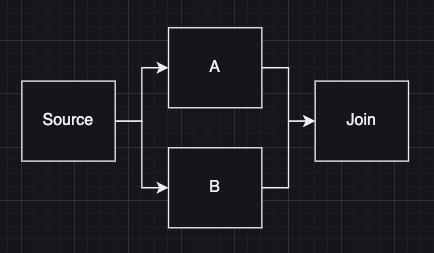
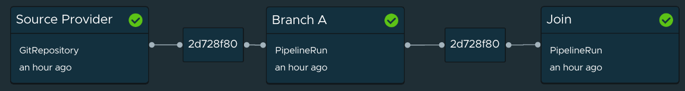

This repo is putting together a proof of concept of how we can do parallel processing with Cartographer as part of work with Tanzu Application Platform (TAP). 

The basic structure for this was taken from https://gitlab.com/drawsmcgraw/cartographer-sonar 

## Order of Operations (Low Level to High Level)

[Task](config/task.yaml)

Tried to keep a very simple `run bash` example here. The echo-string is taken in as a parameter and echoed to standard out. You'll want to retag the alpine image from `docker.io` to your own private repository.

[Pipeline](config/pipeline.yaml)

This is boilerplate that invokes the above task. Note how the echo-string is being passed through.

[Cluster Source Template](config/source-template.yaml)

This is the bridge between Cartographer and Tekton. When this Cartographer stage is called, it will stamp out a PipelineRun to invoke the above Pipeline. 

You'll notice a bunch of refs to source-url and source-revision - for the purpose of this example, they can be ignored, but they are part of the ClusterSourceTemplate [spec](https://cartographer.sh/docs/v0.7.0/reference/template/#clustersourcetemplate).

[Supply Chain](config/supply-chain.yaml)

This is where we demonstrate the parallel/join processing. 

We start by pulling a git repository (this is pointing at a ClusterSourceTemplate provided by TAP), split into two separate stages that invoke the echo task above, and then finally a joint task that waits for the two tasks to finish. 

Unfortunately, TAP GUI (at the time of writing this) doesn't display the parallel stages

[Workload](workload.yaml)

This is what's used to invoke the supply chain. No auth needed to pull that repository in. 